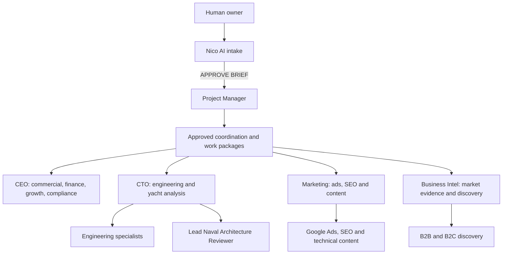

# MORFRAC Agents and Workflows Dashboard

This is the Obsidian navigation and governance view for the MORFRAC Paperclip organisation. It is a dated snapshot, not a live replacement for Paperclip. Check Paperclip before relying on current run state, assignment, model, permissions or heartbeat status.

## Current state

| Item | Verified state as of 2026-09-01 |
| --- | --- |
| Paperclip agents | 43 total: 41 idle, 1 error, 1 manually paused |
| Vault-managed canonical agents | 42; every canonical `AGENTS.md` exists |
| Explicit workflow notes | 267 files under the live agents' `WORKFLOWS` folders |
| Models | 17 GPT-5.6 Sol, 23 GPT-5.6 Terra, 2 GPT-5.6 Luna, Raffa AI alone on GPT-5.5 |
| Heartbeats | Disabled for all agents |
| Human authority | The owner remains final authority; agent output is advice, drafting or controlled internal execution only |

## Attention required

- **Engineering — error:** required OpenAI and Anthropic secret bindings are incomplete. The model migration did not cause or repair this.
- **Research — paused:** manually paused; do not route live work to it until the owner resumes it.
- **Raffa AI — excluded:** its live Paperclip instructions remain outside this vault-managed rollout. Do not treat `02_AGENTS/Raffa_AI` as its live instruction folder or include that legacy folder in company-wide routing.
- **Legacy duplicate:** `02_AGENTS/Technical_Content_Production_Agent` is not a live instruction root. The live Technical Content Production Agent uses [[02_AGENTS/Blog_Website_Content_Creator/AGENTS|Blog_Website_Content_Creator]].
- **Permissions:** the post-upgrade `canCreateSkills` state requires separate review and approval; this dashboard does not approve a change.
- **Deferred integrations:** Odoo, Fusion/CAD, FEA/CAM execution, external release and scheduled grant/tender monitoring remain held as recorded in [[00_SYSTEM/ORGANISATION#Explicit readiness holds|Explicit readiness holds]].

## Operating flow



The diagram shows routing, not delegated approval authority. Use [[00_SYSTEM/ORGANISATION#Approval meanings|Approval meanings]] for the exact human gates.

## Core controls and evidence

- [[00_SYSTEM/ORGANISATION|Organisation, reporting lines, authority and readiness holds]]
- [[00_SYSTEM/SCOPED_RUNTIME|Scoped runtime, source-sharing, save and handoff rules]]
- [[00_SYSTEM/GENERAL_AGENT_RULES|General agent rules and approval models]]
- [[00_SYSTEM/OBSIDIAN_REPORT_STANDARD|Report metadata and retention standard]]
- [[05_BUSINESS/Management/Knowledge_Base/README|Company knowledge index]]
- [[05_BUSINESS/Management/Knowledge_Base/2026-08-31_Readiness_and_Next_Actions|Readiness baseline and next actions]]
- [[05_BUSINESS/Management/Knowledge_Base/Evidence/2026-09-01_Model_Migration_GPT-5.6|GPT-5.6 migration — approved and achieved]]
- [[05_BUSINESS/Management/Knowledge_Base/2026-09-01_Yacht_Analysis_MVP|Yacht analysis team and workflow baseline]]

## Executive intake and project delivery

| Agent | Reports to | State | Canonical instructions | Workflow notes |
| --- | --- | --- | --- | ---: |
| CEO | Human owner | Idle | [[02_AGENTS/CEO/AGENTS|CEO]] | 0 |
| Nico AI | CEO | Idle | [[02_AGENTS/Nico_AI/AGENTS|Nico AI]] | 5 |
| Project Manager | CEO | Idle | [[02_AGENTS/Project_Manager/AGENTS|Project Manager]] | 6 |
| Assistant | CEO | Idle | [[02_AGENTS/Assistant/AGENTS|Assistant]] | 0 |
| Research | CEO | **Paused** | [[02_AGENTS/Research/AGENTS|Research]] | 0 |

## Engineering and production

| Agent | Reports to | State | Canonical instructions | Workflow notes |
| --- | --- | --- | --- | ---: |
| CTO | CEO | Idle | [[02_AGENTS/CTO/AGENTS|CTO]] | 0 |
| Engineering | CTO | **Error** | [[02_AGENTS/Engineering/AGENTS|Engineering]] | 0 |
| FEA Expert Agent | CTO | Idle | [[02_AGENTS/FEA_Expert_Agent/AGENTS|FEA Expert]] | 21 |
| Failure Analysis Agent | CTO | Idle | [[02_AGENTS/Failure_Analysis_Agent/AGENTS|Failure Analysis]] | 21 |
| CNC Manufacturing Expert | CTO | Idle | [[02_AGENTS/CNC_Manufacturing_Expert/AGENTS|CNC Manufacturing]] | 20 |
| Production & Workshop Coordinator | CTO | Idle | [[02_AGENTS/Production_Workshop_Coordinator/AGENTS|Production and Workshop]] | 8 |
| Quality, Inspection & Metrology Agent | CTO | Idle | [[02_AGENTS/Quality_Inspection_Metrology_Agent/AGENTS|Quality and Metrology]] | 22 |
| I+D Documentation Agent | CTO | Idle | [[02_AGENTS/I_D_Documentation_Agent/AGENTS|I+D Documentation]] | 19 |
| Product Documentation Agent | CTO | Idle | [[02_AGENTS/Product_Documentation_Agent/AGENTS|Product Documentation]] | 16 |
| Tomeu AI | CTO | Idle | [[02_AGENTS/Tomeu_AI/AGENTS|Tomeu AI]] | 0 |

## Yacht analysis

These roles use the on-demand, human-reviewed workflow in [[05_BUSINESS/Management/Knowledge_Base/2026-09-01_Yacht_Analysis_MVP|Yacht Analysis MVP]]. A zero below means no separate `WORKFLOWS` folder; it does not make an unimplemented integration operational.

| Agent | Reports to | Canonical instructions | Workflow notes |
| --- | --- | --- | ---: |
| Lead Naval Architecture Reviewer | CTO | [[02_AGENTS/Yacht_Lead_Naval_Architecture_Reviewer/AGENTS|Yacht Lead Reviewer]] | 0 |
| Boat Intake & Document Analyst | Yacht Lead | [[02_AGENTS/Yacht_Boat_Intake_Document_Analyst/AGENTS|Boat Intake]] | 0 |
| Geometry & Sail Plan Analyst | Yacht Lead | [[02_AGENTS/Yacht_Geometry_Sail_Plan_Analyst/AGENTS|Geometry and Sail Plan]] | 0 |
| Deck Layout & Systems Analyst | Yacht Lead | [[02_AGENTS/Yacht_Deck_Layout_Systems_Analyst/AGENTS|Deck Layout and Systems]] | 0 |
| Mission Profile Analyst | Yacht Lead | [[02_AGENTS/Yacht_Mission_Profile_Analyst/AGENTS|Mission Profile]] | 0 |
| Rating & Performance Analyst | Yacht Lead | [[02_AGENTS/Yacht_Rating_Performance_Analyst/AGENTS|Rating and Performance]] | 0 |
| Engineering Loads Analyst | Yacht Lead | [[02_AGENTS/Yacht_Engineering_Loads_Analyst/AGENTS|Engineering Loads]] | 0 |
| Upgrade & Retrofit Strategist | Yacht Lead | [[02_AGENTS/Yacht_Upgrade_Retrofit_Strategist/AGENTS|Upgrade and Retrofit]] | 0 |
| Yacht Cost/Benefit Analyst | Yacht Lead | [[02_AGENTS/Yacht_Cost_Benefit_Analyst/AGENTS|Yacht Cost Benefit]] | 0 |

## Marketing, SEO and content

| Agent | Reports to | Canonical instructions | Workflow notes |
| --- | --- | --- | ---: |
| Marketing | CEO | [[02_AGENTS/Marketing/AGENTS|Marketing]] | 0 |
| Google Ads Planner | Marketing | [[02_AGENTS/Google_Ads_Planner/AGENTS|Google Ads Planner]] | 9 |
| SEO Intelligence Agent | Marketing | [[02_AGENTS/SEO/AGENTS|SEO Intelligence]] | 0 |
| SEO Execution Agent | Marketing | [[02_AGENTS/SEO_Execution_Agent/AGENTS|SEO Execution]] | 0 |
| Technical Content Strategy Agent | SEO Execution | [[02_AGENTS/Technical_Content_Strategy_Agent/AGENTS|Technical Content Strategy]] | 0 |
| Technical Content Production Agent | SEO Execution | [[02_AGENTS/Blog_Website_Content_Creator/AGENTS|Technical Content Production]] | 8 |

## Commercial, finance, market development and growth

| Agent | Reports to | Canonical instructions | Workflow notes |
| --- | --- | --- | ---: |
| Project Costing Analyst | CEO | [[02_AGENTS/Project_Costing_Analyst/AGENTS|Project Costing]] | 11 |
| Project Proposal Agent | CEO | [[02_AGENTS/Project_Proposal_Agent/AGENTS|Project Proposal]] | 11 |
| Accounting Agent | CEO | [[02_AGENTS/Accounting_Agent/AGENTS|Accounting]] | 0 |
| Business Intel | CEO | [[02_AGENTS/Buisiness_Intel/AGENTS|Business Intel]] | 0 |
| B2B Problem Discovery Agent | Business Intel | [[02_AGENTS/STRATEGIC/B2B_Problem_Discovery/AGENTS|B2B Problem Discovery]] | 0 |
| B2C Product Discovery Agent | Business Intel | [[02_AGENTS/STRATEGIC/B2C_PRODUCT_DISCOVERY/AGENTS|B2C Product Discovery]] | 0 |
| Company Strategy & Growth Agent | CEO | [[02_AGENTS/Company_Strategy_Growth_Agent/AGENTS|Company Strategy and Growth]] | 21 |
| Product Incubation Agent | CEO | [[02_AGENTS/STRATEGIC/PRODUCT_INCUBATION/AGENTS|Product Incubation]] | 0 |

## Legal, trade and public opportunities

| Agent | Reports to | Canonical instructions | Workflow notes |
| --- | --- | --- | ---: |
| Legal Agent | CEO | [[02_AGENTS/Legal_Agent/AGENTS|Legal]] | 14 |
| Customs & Shipping Documentation Agent | CEO | [[02_AGENTS/Customs_Shipping_Documentation_Agent/AGENTS|Customs and Shipping]] | 17 |
| Ayudas y Subvenciones Agent | CEO | [[02_AGENTS/Ayudas_Subvenciones_Agent/AGENTS|Grants and Subsidies]] | 18 |
| Public Tenders Agent | CEO | [[02_AGENTS/Public_Tenders_Agent/AGENTS|Public Tenders]] | 20 |

## Key end-to-end workflows

### Intake and project control

1. [[02_AGENTS/Nico_AI/WORKFLOWS/PROJECT_INTAKE|Nico project intake]]
2. [[02_AGENTS/Nico_AI/WORKFLOWS/PROJECT_HANDOFF|Approved project handoff]]
3. [[02_AGENTS/Project_Manager/WORKFLOWS/PM_TASK_INTAKE|PM task intake]]
4. [[02_AGENTS/Project_Manager/WORKFLOWS/PROJECT_CREATION|Approved project creation]]
5. [[02_AGENTS/Project_Manager/WORKFLOWS/PROJECT_COORDINATION|Project coordination]]
6. [[02_AGENTS/Project_Manager/WORKFLOWS/CHANGE_CONTROL|Change control]]
7. [[02_AGENTS/Project_Manager/WORKFLOWS/RESUME_AND_CLOSEOUT|Resume and closeout]]

### Proposal path

1. [[02_AGENTS/Project_Manager/WORKFLOWS/PREPARE_PROPOSALS|PM proposal preparation]]
2. [[02_AGENTS/Project_Proposal_Agent/WORKFLOWS/PROPOSAL_TASK_INTAKE|Proposal intake]]
3. [[02_AGENTS/Project_Proposal_Agent/WORKFLOWS/PROPOSAL_ASSEMBLY|Proposal assembly]]
4. [[02_AGENTS/Project_Proposal_Agent/WORKFLOWS/PRICING_AND_OPTIONS|Pricing and options review]]
5. [[02_AGENTS/Project_Proposal_Agent/WORKFLOWS/TERMS_AND_LEGAL_REVIEW|Terms and legal review]]
6. [[02_AGENTS/Project_Proposal_Agent/WORKFLOWS/SAVE_AND_VERSION|Save and version]]
7. [[02_AGENTS/Project_Proposal_Agent/WORKFLOWS/RELEASE_HANDOFF|Human release handoff]]

### Specialist and system paths

- Use each agent's linked `AGENTS.md` as the current role boundary and its `README.md`/`WORKFLOWS` folder where present.
- [[02_AGENTS/Accounting_Agent/REFERENCE/CONNECTION_SETUP|Accounting/Odoo connection prerequisites]] remain a hold, not a completed integration.
- [[05_BUSINESS/Management/Knowledge_Base/2026-09-01_Yacht_Analysis_MVP|Yacht analysis workflow]] is on-demand and requires human design authority.
- [[00_SYSTEM/FILE_RULES|File rules]] and [[00_SYSTEM/SCOPED_RUNTIME|scoped runtime]] govern every save and handoff.

## All explicit workflow notes

```dataview
TABLE WITHOUT ID file.link AS Workflow, file.folder AS "Agent folder"
FROM "02_AGENTS"
WHERE contains(file.path, "/WORKFLOWS/")
SORT file.folder ASC, file.name ASC
```

## Related Links

- [[005 - DASHBOARD LATEST REPORTS AND INFORMATION|Latest reports, review queues and information graphics]]
- [[000 - DASHBOARD MORFRAC|Main MORFRAC dashboard]]
- [[00_SYSTEM/ORGANISATION|Current organisation and authority]]
- [[05_BUSINESS/Management/Knowledge_Base/README|Company knowledge index]]
- [[05_BUSINESS/Management/Knowledge_Base/Evidence/2026-09-01_Model_Migration_GPT-5.6|Model migration evidence]]
- [[05_BUSINESS/Management/Knowledge_Base/2026-09-01_Yacht_Analysis_MVP|Yacht workflow baseline]]
