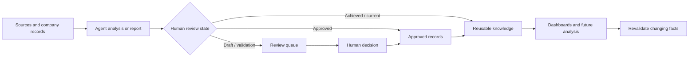

# MORFRAC Latest Reports and Information

This dashboard is the live retrieval layer for durable MORFRAC information in Obsidian. Tables refresh from note properties and modification time. Charts refresh from the vault index. Paperclip remains authoritative for live agent state, assignments and approvals.

```dashboard
title: Latest Reports & Information
rows:
  - height: 126
    columns:
      - width: 3
        widget:
          type: link
          target: 000 - DASHBOARD
          description: Return to the MORFRAC command center.
      - width: 3
        widget:
          type: link
          target: 000 - DASHBOARD MORFRAC
          description: Company operations, governance and analysis access.
      - width: 3
        widget:
          type: link
          target: 001 - DASHBOARD AGENTS AND WORKFLOWS
          description: Agent structure, routing and workflow index.
      - width: 3
        widget:
          type: link
          target: 05_BUSINESS/Management/Knowledge_Base/README
          description: Current reference pack and durable evidence.
  - height: 310
    columns:
      - width: 7
        widget:
          type: chart
          chart:
            type: bar
            sql: SELECT COUNT(*) FROM notes GROUP BY month(file.mtime) ORDER BY label asc
            title: Vault information updated by month
            dataLabels: top
            showGridlines: false
            colors:
              - "#2a9d8f"
              - "#4e79a7"
            height: 280
      - width: 5
        widget:
          type: chart
          chart:
            type: doughnut
            sql: SELECT COUNT(*) WHERE status = 'current_reference' AS "Current reference", COUNT(*) WHERE status = 'achieved' AS "Achieved", COUNT(*) WHERE status = 'configured' AS "Configured", COUNT(*) WHERE status = 'implemented_mvp' AS "Implemented MVP", COUNT(*) WHERE status = 'DRAFT_FOR_REVIEW' AS "Draft review", COUNT(*) WHERE status = 'VALIDATION_REQUIRED' AS "Validation" FROM notes
            title: Recorded lifecycle states
            dataLabels: outside
            colors:
              - "#4e79a7"
              - "#59a14f"
              - "#76b7b2"
              - "#edc949"
              - "#f28e2b"
              - "#e15759"
            height: 280
  - height: 300
    columns:
      - width: 7
        widget:
          type: chart
          chart:
            type: bar
            sql: SELECT COUNT(*) WHERE source_agent IS NOT EMPTY AS "Agent records", COUNT(*) WHERE type IS NOT EMPTY AS "Type tagged", COUNT(*) WHERE status IS NOT EMPTY AS "Status tagged", COUNT(*) WHERE approval_status IS NOT EMPTY AS "Approval tagged", COUNT(*) WHERE related_projects IS NOT EMPTY AS "Project linked" FROM notes
            title: Vault metadata signals (record counts)
            dataLabels: top
            showGridlines: false
            colors:
              - "#4e79a7"
              - "#59a14f"
              - "#76b7b2"
              - "#f28e2b"
              - "#e15759"
            height: 270
      - width: 5
        widget:
          type: chart
          chart:
            type: calendar
            sql: SELECT COUNT(*) FROM notes
            title: Vault activity calendar
            colors:
              - "#264653"
              - "#2a9d8f"
              - "#e9c46a"
              - "#f4a261"
            height: 270
```

> [!note] Reading the graphics
> The charts are live vault-index counts, not financial KPIs. “Agent records” means notes with `source_agent`; the other metadata signals count each field wherever present. A record appearing as current, approved or achieved does not make changing external facts current—revalidate those facts before use.

## Information flow



## Latest reports

Current runtime evidence: [[05_BUSINESS/Management/Knowledge_Base/Evidence/2026-09-02_Paperclip_Connector_Runtime_and_Attachment_Repair|42-agent scoped connector and attachment repair — validated]]. `MORAAAAA-141` is intentionally blocked for owner inputs and Drafting/Fusion routing approval; its execution is not running.

Most recently modified agent-generated records, excluding dashboards.

```dataview
TABLE WITHOUT ID
file.link AS Report,
source_agent AS Agent,
type AS Type,
status AS Status,
approval_status AS Approval,
dateformat(file.mtime, "yyyy-MM-dd HH:mm") AS Updated
FROM ""
WHERE source_agent
AND type != "dashboard"
SORT file.mtime DESC
LIMIT 25
```

## Needs human review or validation

These records carry an explicit draft, review or validation state. They are not approved for external release merely because they appear here.

```dataview
TABLE WITHOUT ID
file.link AS Record,
source_agent AS Agent,
status AS Status,
approval_status AS Approval,
dateformat(file.mtime, "yyyy-MM-dd HH:mm") AS Updated
FROM ""
WHERE source_agent
AND type != "dashboard"
AND (
  status = "DRAFT_NOT_RELEASED"
  OR status = "DRAFT_FOR_REVIEW"
  OR status = "VALIDATION_REQUIRED"
  OR approval_status = "PENDING_HUMAN_APPROVAL"
)
SORT file.mtime DESC
```

## Approved records

Approval is taken only from explicit approval metadata. Owner-requested drafting or implementation is not automatically treated as approval for external release.

```dataview
TABLE WITHOUT ID
file.link AS Record,
source_agent AS Agent,
type AS Type,
approval_status AS Approval,
dateformat(file.mtime, "yyyy-MM-dd HH:mm") AS Updated
FROM ""
WHERE source_agent
AND type != "dashboard"
AND (
  approval_status = "approved"
  OR approval_status = "owner_authorised_archival"
  OR approval_status = "owner_authorised_configuration"
)
SORT file.mtime DESC
LIMIT 25
```

## Achieved and current records

These records describe achieved, configured, implemented or current-reference states. Check their `as_of` date and evidence before using them for a new decision.

```dataview
TABLE WITHOUT ID
file.link AS Record,
source_agent AS Agent,
type AS Type,
status AS Status,
as_of AS "As of",
dateformat(file.mtime, "yyyy-MM-dd HH:mm") AS Updated
FROM ""
WHERE source_agent
AND type != "dashboard"
AND (
  status = "achieved"
  OR status = "configured"
  OR status = "implemented_mvp"
  OR status = "current_reference"
)
SORT file.mtime DESC
LIMIT 25
```

## Latest information by company area

### Engineering and production

```dataview
TABLE WITHOUT ID file.link AS Record, source_agent AS Agent, type AS Type, status AS Status, dateformat(file.mtime, "yyyy-MM-dd") AS Updated
FROM "04_ENGINEERING"
WHERE source_agent
SORT file.mtime DESC
LIMIT 10
```

### Business, finance and strategy

```dataview
TABLE WITHOUT ID file.link AS Record, source_agent AS Agent, type AS Type, status AS Status, dateformat(file.mtime, "yyyy-MM-dd") AS Updated
FROM "05_BUSINESS"
WHERE source_agent
SORT file.mtime DESC
LIMIT 10
```

### Marketing and commercial intelligence

```dataview
TABLE WITHOUT ID file.link AS Record, source_agent AS Agent, type AS Type, status AS Status, dateformat(file.mtime, "yyyy-MM-dd") AS Updated
FROM "06_MARKETING"
WHERE source_agent
SORT file.mtime DESC
LIMIT 10
```

### Active project records

```dataview
TABLE WITHOUT ID file.link AS Record, source_agent AS Agent, type AS Type, status AS Status, dateformat(file.mtime, "yyyy-MM-dd") AS Updated
FROM "08_PROJECTS"
WHERE source_agent
SORT file.mtime DESC
LIMIT 10
```

## Metadata repair queue

Recent agent-generated records missing one or more of the core `type`, `status` or `approval_status` fields. This is a cleanup queue, not a reason to discard the underlying evidence.

```dataview
TABLE WITHOUT ID
file.link AS Record,
source_agent AS Agent,
type AS Type,
status AS Status,
approval_status AS Approval,
dateformat(file.mtime, "yyyy-MM-dd HH:mm") AS Updated
FROM ""
WHERE source_agent
AND type != "dashboard"
AND (!type OR !status OR !approval_status)
SORT file.mtime DESC
LIMIT 30
```

## Operating rules

- Open the source note and follow its citations before using a conclusion.
- Keep draft, validated, approved and achieved classifications separate.
- Revalidate external facts such as prices, deadlines, laws, grant windows, tender status and software availability.
- Do not treat Obsidian as the live Paperclip status system or as the Odoo accounting ledger.
- Use [[00_SYSTEM/OBSIDIAN_REPORT_STANDARD|the report standard]] for new records so future dashboards can classify them reliably.

## Related links

- [[000 - DASHBOARD|MORFRAC command center]]
- [[000 - DASHBOARD MORFRAC|Company dashboard]]
- [[001 - DASHBOARD AGENTS AND WORKFLOWS|Agents and workflows dashboard]]
- [[05_BUSINESS/Management/Knowledge_Base/README|Company knowledge index]]
- [[00_SYSTEM/OBSIDIAN_REPORT_STANDARD|Obsidian report standard]]
